# UC002 - Gerenciar Perfis e Permissões

## Objetivo
Criar, alterar e remover permissões associadas aos perfis de usuários do sistema.

## Atores

### Ator Principal
- Administrador do Sistema

### Atores Secundários
- Serviço de Auditoria
- Banco de Dados

## Pré-condições

- O usuário deve estar autenticado.
- O usuário deve possuir a permissão **GERENCIAR_PERFIS**.
- O módulo de autenticação deve estar disponível.

## Pós-condições

- Perfil criado, alterado ou removido com sucesso.
- Permissões persistidas no banco de dados.
- Registro de auditoria criado.

---

# Artefato 1 — Detalhamento Técnico

## Dicionário de Dados da Tela

| Campo | Tipo | Obrigatório | Validação / Regra |
|-------|------|-------------|-------------------|
| Nome do Perfil | Texto(100) | Sim | Único, mínimo 3 caracteres |
| Descrição | Texto(255) | Não | Máximo 255 caracteres |
| Permissões | Lista<Permissão> | Sim | Deve possuir pelo menos uma permissão |
| Status | Enum | Sim | Ativo/Inativo |

## Fluxo Principal Detalhado

### 1. Acesso à funcionalidade

1. O Administrador seleciona o menu **Segurança → Perfis e Permissões**.
2. O sistema valida a sessão do usuário.
3. O sistema valida se o usuário possui a permissão **GERENCIAR_PERFIS**.
4. O sistema consulta todos os perfis cadastrados.
5. O sistema renderiza a tela contendo:
   - Lista de perfis;
   - Campo de pesquisa;
   - Botão Novo Perfil;
   - Botão Editar;
   - Botão Excluir.

### 2. Cadastro

1. O Administrador seleciona **Novo Perfil**.
2. O sistema apresenta o formulário.
3. O Administrador informa:
   - Nome;
   - Descrição;
   - Permissões.
4. O sistema valida os campos obrigatórios.
5. O sistema verifica duplicidade.
6. O sistema grava os dados.
7. O sistema registra auditoria.
8. O sistema apresenta:

> Perfil cadastrado com sucesso.

...

## Fluxos Alternativos

### A1 — Nome duplicado

Condição

Já existe um perfil com o mesmo nome.

Comportamento

- Não grava dados.
- Destaca o campo Nome.

Mensagem

> Já existe um perfil cadastrado com este nome.

### A2 — Permissão insuficiente

Condição

Usuário sem autorização.

Comportamento

- Cancela operação.
- Registra tentativa.

Mensagem

> Você não possui permissão para realizar esta operação.

### A3 — Perfil vinculado

Condição

Perfil possui usuários associados.

Comportamento

- Não exclui.

Mensagem

> O perfil não pode ser excluído porque está vinculado a usuários ativos.

---

## Rastreabilidade Restrita

### RF

- RF001
- RF002
- RF004

### RN

- RN001
- RN002
- RN004
- RN006

### RNF

- RNF001
- RNF003
- RNF005

### CA

- CA001
- CA002
- CA003

---

## Logs de Auditoria

Evento

Alteração de Perfil

Registrar

- Data/Hora
- Usuário
- IP
- Perfil alterado
- Operação (INSERT/UPDATE/DELETE)
- Valores anteriores
- Valores novos
- Identificador da sessão
- Resultado
- Motivo da falha (quando existir)

---

# Artefato 2 — Diagrama de Sequência

```plantuml
@startuml
...
@enduml
```



---

# Artefato 3 — Diagrama de Atividades

```plantuml
@startuml
start
...
stop
@enduml
```