# UC004 - Registrar Logs de Autenticação

## Objetivo

Registrar automaticamente os eventos de autenticação (login) e encerramento de sessão, garantindo rastreabilidade dos acessos ao SIG-GCM.

## Ator Principal

- Administrador do Sistema

## Pré-condições

- O usuário realizou uma tentativa de login ou logout.
- O serviço de autenticação está disponível.

## Pós-condições

- O evento é registrado na base de auditoria.
- O log fica disponível para consultas administrativas.

---

# Dicionário de Dados

| Campo | Tipo | Obrigatório | Validação |
|--------|------|-------------|-----------|
| ID do Log | UUID | Sim | Gerado automaticamente |
| Usuário | Referência | Sim | Usuário existente |
| Evento | Enum | Sim | LOGIN ou LOGOUT |
| Resultado | Enum | Sim | SUCESSO ou FALHA |
| Data/Hora | DateTime | Sim | Obtida do servidor |
| Endereço IP | IPv4/IPv6 | Sim | Capturado automaticamente |
| Sessão | UUID | Sim | Gerado automaticamente |
| Motivo da Falha | Texto | Não | Obrigatório quando houver falha |

---

# Fluxo Principal

1. O usuário informa login e senha.
2. O sistema valida as credenciais.
3. O sistema identifica o endereço IP da conexão.
4. O sistema identifica o perfil institucional do usuário.
5. O sistema gera um identificador de sessão.
6. O sistema registra automaticamente um log de autenticação contendo:
   - usuário;
   - data e hora;
   - endereço IP;
   - perfil;
   - resultado da autenticação.
7. O sistema concede acesso ao usuário.
8. Quando ocorre o logout, o sistema registra o encerramento da sessão.
9. O sistema apresenta:

> **Operação realizada com sucesso.**

---

# Fluxos Alternativos e Exceções

## A1 – Credenciais inválidas

**Condição**

Login ou senha inválidos.

**Mensagem**

> Usuário ou senha inválidos.

---

## A2 – Usuário bloqueado

**Mensagem**

> Usuário bloqueado. Entre em contato com o administrador do sistema.

---

## A3 – Acesso não autorizado

**Mensagem**

> Você não possui permissão para executar esta operação.

---

## A4 – Falha ao registrar auditoria

**Mensagem**

> Não foi possível registrar o evento de auditoria. Tente novamente mais tarde.

---

# Regras de Negócio

- RN001 – Apenas usuários autenticados podem possuir sessões.
- RN002 – Todo login gera um registro de auditoria.
- RN003 – Todo logout atualiza o registro da sessão.
- RN004 – Tentativas inválidas são registradas.
- RN005 – O endereço IP deve ser armazenado.
- RN006 – Data e hora são obtidas do servidor.
- RN007 – Logs não podem ser alterados.
- RN008 – Apenas administradores podem consultar os logs.
- RN009 – Os registros devem permanecer disponíveis para auditoria.

---

# Rastreabilidade

## Requisitos Funcionais

- RF001 – Autenticação de usuários.
- RF002 – Controle de perfis e permissões.
- RF004 – Registro de logs de autenticação.

## Regras de Negócio

- RN001
- RN002
- RN003
- RN004
- RN005
- RN006
- RN007
- RN008
- RN009

## Critérios de Aceitação

- Controle de acesso por perfil.
- Registro de auditoria obrigatório.
- Mensagens claras de sucesso e erro.

---

# Logs de Auditoria

| Informação | Obrigatório |
|------------|-------------|
| ID do Log | Sim |
| Usuário | Sim |
| Evento | Sim |
| Resultado | Sim |
| Data/Hora | Sim |
| Endereço IP | Sim |
| Sessão | Sim |
| Navegador | Sim |
| Sistema Operacional | Sim |
| Motivo da Falha | Quando aplicável |

---

# Diagrama de Sequência

```plantuml
@startuml
...
@enduml
```



---

# Diagrama de Atividades

```plantuml
@startuml
start
...
stop
@enduml
```