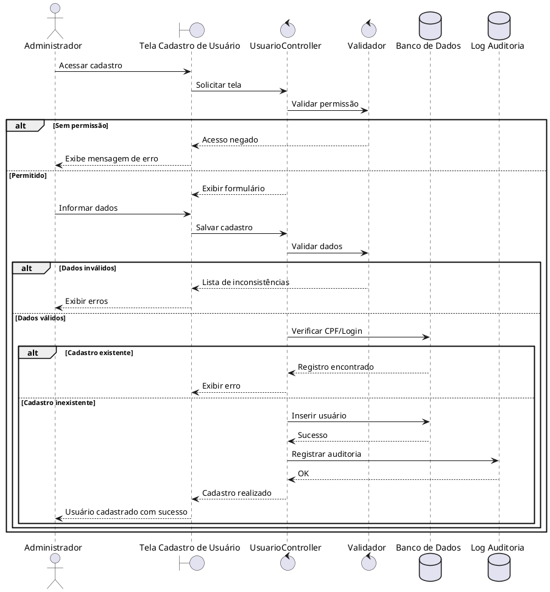
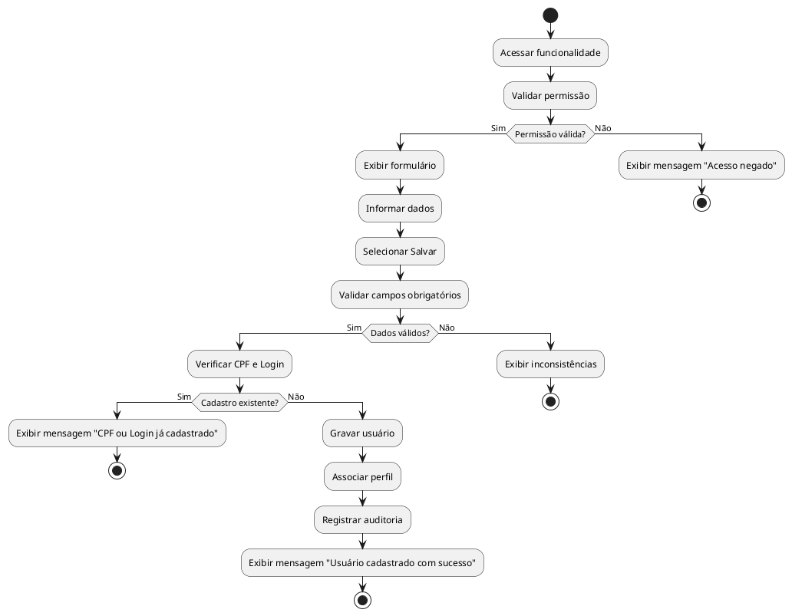

# UC005 - Cadastrar Usuários

## Objetivo

Permitir que o Administrador do Sistema cadastre novos usuários vinculados à corporação da Guarda Civil Municipal (GCM), definindo suas informações institucionais e perfil de acesso para utilização dos módulos operacionais e administrativos do SIG-GCM.

---

# Dicionário de Dados da Tela

| Campo | Tipo de Dado | Obrigatório | Validação / Regra |
|--------|--------------|-------------|-------------------|
| Matrícula | Numérico (20) | Sim | Deve existir no cadastro de servidores e ser única entre usuários ativos. |
| Nome Completo | Texto (150) | Sim | Preenchido automaticamente a partir da matrícula ou informado manualmente conforme integração disponível. |
| CPF | Texto (11) | Sim | Deve possuir 11 dígitos válidos e não existir outro usuário com o mesmo CPF. |
| E-mail Institucional | E-mail | Sim | Deve possuir formato válido e domínio institucional. Deve ser único. |
| Perfil de Acesso | Lista | Sim | Valor previamente cadastrado no módulo de perfis (Administrador, Supervisor, Operador etc.). |
| Unidade | Lista | Sim | Deve corresponder a uma unidade cadastrada. |
| Situação | Lista | Sim | Ativo ou Inativo. Valor padrão: Ativo. |
| Login | Texto (50) | Sim | Deve ser único no sistema. Não permite caracteres especiais não autorizados. |
| Senha Inicial | Senha | Sim | Deve atender à política institucional de senha. |
| Confirmar Senha | Senha | Sim | Deve ser idêntica à senha informada. |
| Observações | Texto (500) | Não | Campo opcional para observações administrativas. |

---

# Fluxo Principal Detalhado

1. O Administrador acessa o menu **Administração → Gestão de Usuários → Cadastrar Usuário**.
2. O sistema verifica se o usuário autenticado possui permissão para cadastrar usuários.
3. O sistema renderiza a tela de cadastro contendo todos os campos obrigatórios e opcionais.
4. O Administrador informa a matrícula do servidor.
5. O sistema consulta os dados cadastrais do servidor.
6. O sistema preenche automaticamente os dados disponíveis (nome, CPF, unidade e demais informações institucionais), quando houver integração.
7. O Administrador informa ou confirma:
   - Perfil de acesso;
   - Login;
   - Senha inicial;
   - Confirmação da senha;
   - Situação;
   - Observações (opcional).
8. O Administrador seleciona **Salvar**.
9. O sistema valida:
   - Permissão do usuário;
   - Campos obrigatórios;
   - CPF válido;
   - E-mail institucional válido;
   - Login único;
   - CPF não cadastrado;
   - Matrícula existente;
   - Perfil informado;
   - Regras de senha.
10. O sistema grava o novo usuário na base de dados.
11. O sistema associa o usuário ao perfil informado.
12. O sistema registra a operação na auditoria.
13. O sistema apresenta a mensagem:

> **Usuário cadastrado com sucesso.**

14. O sistema disponibiliza o novo usuário para utilização dos módulos conforme seu perfil de acesso.

---

# Fluxos Alternativos e de Exceção

## A1 – Campos obrigatórios não informados

Caso algum campo obrigatório esteja vazio:

**Mensagem apresentada**

> "Existem campos obrigatórios não preenchidos. Verifique os campos destacados."

A operação não é realizada.

---

## A2 – Usuário sem permissão

Caso o usuário autenticado não possua autorização para cadastrar usuários:

**Mensagem apresentada**

> "Acesso negado. Você não possui permissão para cadastrar usuários."

A operação é encerrada.

---

## A3 – Matrícula inexistente

Caso a matrícula informada não esteja cadastrada.

**Mensagem apresentada**

> "Servidor não encontrado para a matrícula informada."

Nenhum dado é carregado.

---

## A4 – CPF já cadastrado

Caso exista outro usuário utilizando o mesmo CPF.

**Mensagem apresentada**

> "Já existe um usuário cadastrado com este CPF."

O cadastro é cancelado.

---

## A5 – Login já existente

Caso o login informado esteja sendo utilizado.

**Mensagem apresentada**

> "O login informado já está em uso."

O sistema solicita novo login.

---

## A6 – E-mail inválido

Caso o e-mail possua formato inválido.

**Mensagem apresentada**

> "Informe um e-mail institucional válido."

---

## A7 – Senhas diferentes

Caso senha e confirmação sejam diferentes.

**Mensagem apresentada**

> "A confirmação da senha não confere."

---

## A8 – Senha fora da política

Caso a senha não atenda aos requisitos mínimos.

**Mensagem apresentada**

> "A senha informada não atende à política de segurança."

---

## A9 – Erro interno

Caso ocorra falha na gravação.

**Mensagem apresentada**

> "Não foi possível concluir o cadastro do usuário. Tente novamente."

O sistema desfaz toda a transação.

---

# Rastreabilidade Restrita

## Requisitos Funcionais (RF)

| Código | Aplicação |
|---------|-----------|
| RF001 | Usuário deve estar autenticado. |
| RF002 | Controle de perfis e permissões. |
| RF005 | Cadastro de usuários vinculados à corporação. |
| RF004 | Registro de logs e auditoria. |

## Regras de Negócio (RN)

| Código | Aplicação |
|---------|-----------|
| RN001 | Somente administradores podem cadastrar usuários. |
| RN002 | Login deve ser único. |
| RN003 | CPF deve ser único. |
| RN004 | Usuário deve possuir perfil válido. |
| RN005 | Usuário deve estar vinculado à corporação. |
| RN006 | Senha deve atender à política institucional. |
| RN007 | Cadastro deve ser auditável. |
| RN008 | Usuário deve iniciar com situação definida. |
| RN009 | Dados obrigatórios devem ser validados antes da gravação. |

## Requisitos Não Funcionais (RNF)

| Código | Aplicação |
|---------|-----------|
| RNF008 | Registro de auditoria das operações críticas. |

## Critérios de Aceitação (CA)

| Código | Aplicação |
|---------|-----------|
| CA001 | Apenas usuários autorizados podem acessar a funcionalidade. |
| CA009 | O sistema deve registrar logs das operações críticas. |

---

# Logs de Auditoria

A operação de cadastro de usuário é considerada crítica e deve registrar os seguintes dados:

| Informação | Descrição |
|------------|-----------|
| Data e hora | Timestamp da operação |
| Tipo da operação | Cadastro de usuário |
| Usuário executor | Login do administrador |
| Matrícula do administrador | Identificação institucional |
| Endereço IP | Origem da requisição |
| Nome da estação | Equipamento utilizado |
| Usuário cadastrado | Login criado |
| Matrícula do usuário | Matrícula vinculada |
| Perfil atribuído | Perfil concedido |
| Unidade | Unidade institucional |
| Situação | Ativo/Inativo |
| Resultado | Sucesso ou Falha |
| Motivo da falha | Quando houver |

---

# Diagrama de Sequência (PlantUML)

---

# Diagrama de Atividades (PlantUML)

